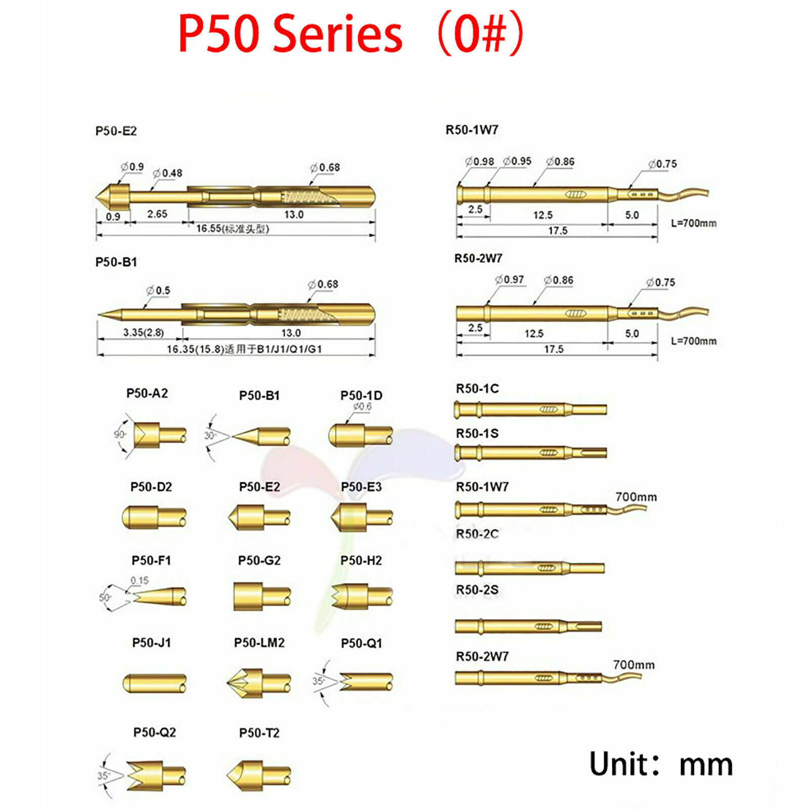
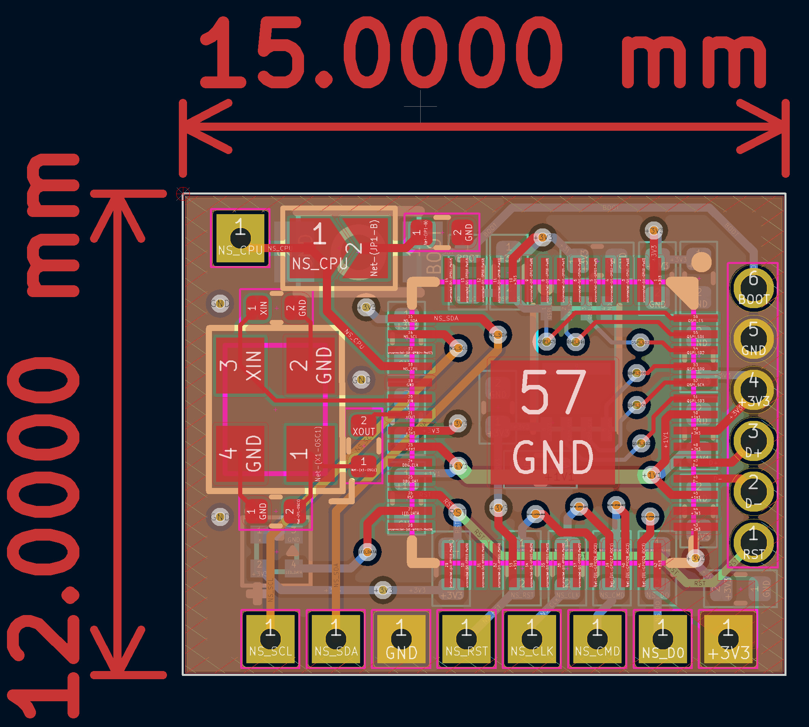
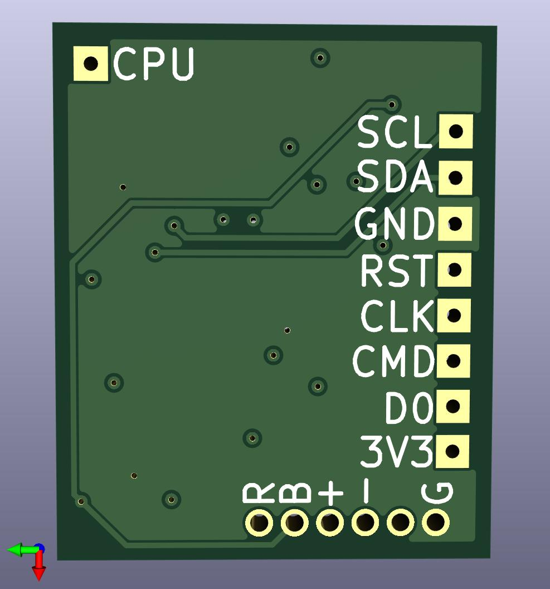
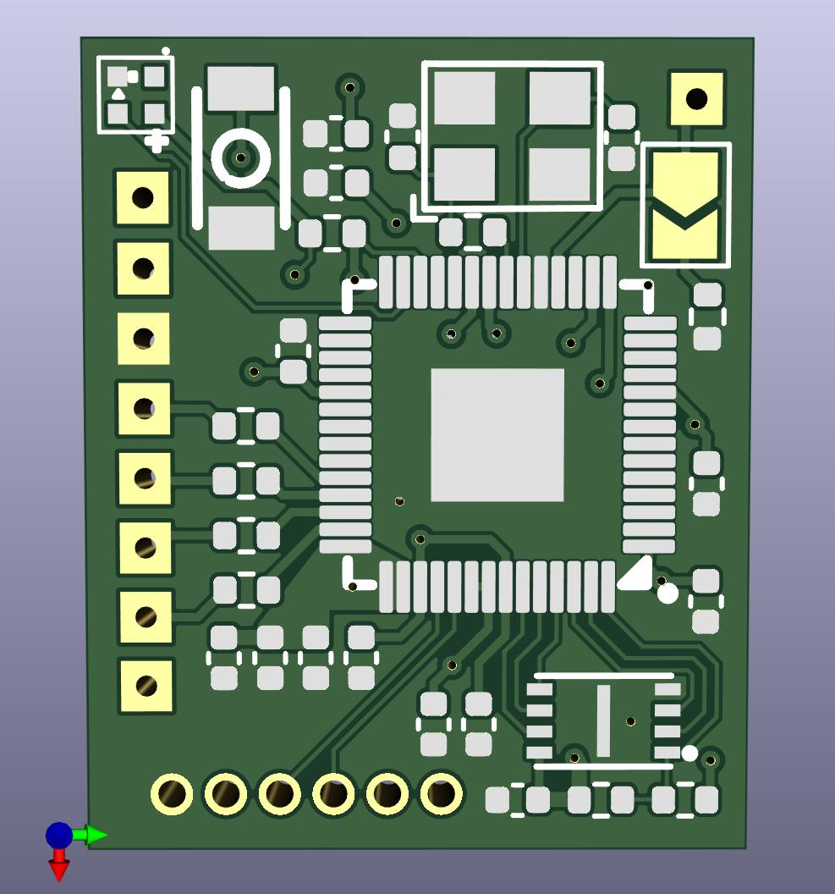
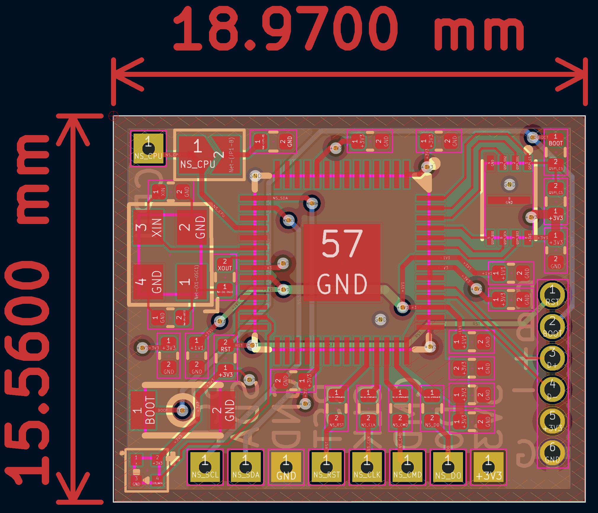

# fly2040
Basic RP2040 board.

Note - most of these boards require a 3.3V power supply when programming.
The intention is to be able to program the boards with a 1.27mm pitch test clip / pogo pins.

The usb-programmer board is designed to accept the P50-E2 (shaft diameter 0.68mm) which should be soldered in
to the (programmer) board.

The v1 fly2040 board has been tested and is working except for the led/5V boost circuit - don't use.
The v2 fly2040 board is work in progress - don't use.
The fly2040_min board is going through assembly and testing now - no issues expected.
The fly2040_ds is not yet tested and going through updates.

There are currently 3 boards.

The fly2040 is an experimental board with line isolation and USB isolation.
The intention here is to be able to disconnect the lines when not in use.

The fly2040_min board is an attempt at making a single sided board as small
as possible.

The fly2040_ds is a tiny double sided board. The double sided board is tiny!! 
15mm x 12mm (0.59in x 0.47in)

Panels provided for fabrication.

The mini board is a little bigger but cheaper to get assembled.

